# Buffer Utilisation in SCTP

Buffer utilisation measures how effectively the SCTP protocol uses send and receive buffers. Proper buffer management is crucial for maintaining optimal throughput and preventing congestion.

## Importance in SCTP

Buffer utilisation metrics are important because:

1. They directly impact throughput performance
2. Multi-streaming in SCTP creates unique buffer management challenges
3. Buffer pressure can lead to head-of-line blocking despite multi-streaming
4. Send buffer utilisation affects the behavior of the SCTP congestion control

## Buffer Management Mechanism

```mermaid
flowchart TD
    subgraph Receiver
    A["Receiver initializes a/rwnd<br>to total buffer size"] --> B["Receiver receives DATA chunk"]
    B --> C["Buffer space decreases<br>a/rwnd = a/rwnd - chunk size"]
    C --> D["Receiver sends SACK with<br>current a/rwnd value"]
    D --> E["Application reads data<br>from buffer"]
    E --> F["Buffer space increases<br>a/rwnd = a/rwnd + bytes read"]
    F --> G["Update a/rwnd in next SACK"]
    G --> B
    end
    
    subgraph Sender
    H["Sender tracks peer's a/rwnd"] --> I["Sender has data to transmit"]
    I --> J{Enough a/rwnd<br>available?}
    J -->|Yes| K["Send DATA within a/rwnd limit"]
    K --> L["Update peer a/rwnd tracking<br>a/rwnd = a/rwnd - chunk size"]
    L --> M["Receive SACK"]
    M --> N["Update peer a/rwnd from SACK"]
    N --> I
    J -->|No| O["Wait for SACK with<br>larger a/rwnd"]
    O --> I
    end

    style C fill:#bbf,stroke:#333
    style F fill:#bbf,stroke:#333
    style J fill:#bbf,stroke:#333
    style L fill:#bbf,stroke:#333
    style N fill:#bbf,stroke:#333
```



## Key Buffer Parameters in SCTP

1. **Send Buffer (sndbuf)**: Controls how much data can be queued for transmission
2. **Receive Buffer (rcvbuf)**: Controls how much data can be received before being processed by the application
3. **Advertised Receiver Window (a/rwnd)**: Communicated in SACK chunks to inform the sender of available receive buffer space
4. **Outstanding Data**: Amount of data sent but not yet acknowledged
5. **Outqueue Size**: Amount of data queued for transmission

## SCTP-Specific Buffer Considerations

- **Multi-streaming impact**: All streams share a single buffer pool
- **Stream priority**: No built-in buffer reservation for high-priority streams
- **Zero window handling**: Special handling when a/rwnd reaches zero
- **Buffer blocking**: Can occur when the application reads data from streams unevenly

## Measuring Buffer utilisation with `sctp_bufmon.py`

The `sctp_bufmon.py` tool uses eBPF to monitor buffer-related events in the kernel:

1. Traces [sctp_outq_tail](https://elixir.bootlin.com/linux/v6.16/source/net/sctp/outqueue.c#L281) to track data being added to the outbound queue
2. Traces [sctp_outq_flush](https://elixir.bootlin.com/linux/v6.16/source/net/sctp/outqueue.c#L1192) to monitor when the outbound queue is flushed for transmission
3. Traces [sctp_wait_for_sndbuf](https://elixir.bootlin.com/linux/v6.16/source/net/sctp/socket.c#L9219) to detect when an application is blocked waiting for send buffer space
4. Traces `sctp_write_space` to monitor when buffer space becomes available
5. Calculates key metrics:
   - Send buffer utilisation percentage (used vs. total)
   - Outbound queue size over time
   - Receiver window (rwnd) advertised by the peer
   - Buffer pressure events frequency

Example usage:
```bash
sudo ./sctp_bufmon.py          # Monitor all SCTP associations
```

## Interpreting Buffer utilisation Results

- **High send buffer utilisation (>80%)**: May indicate network congestion, insufficient buffer size, or receiver not keeping up
- **Frequent SNDBUF_WAIT events**: Application is being blocked by buffer limitations, potentially reducing throughput
- **Large outqueue size**: Indicates data queued but not yet transmitted, possibly due to congestion or flow control
- **Decreasing rwnd values**: Shows the receiver is accumulating data faster than it can process
- **Buffer utilisation spikes**: Can reveal bursty traffic patterns or application-level processing bottlenecks
- **Zero or near-zero rwnd**: Indicates receiver congestion requiring zero window probing

## Optimizing SCTP Buffer Usage

1. **Increase buffer sizes**: For high-throughput scenarios, especially with high RTT
2. **Application-level flow control**: Balance data production with consumption rates
3. **Stream distribution**: Distribute data across streams based on processing priority
4. **Buffer tuning parameters**:
   - `/proc/sys/net/sctp/rmem_default` and `/proc/sys/net/sctp/rmem_max` for receive buffers
   - `/proc/sys/net/sctp/wmem_default` and `/proc/sys/net/sctp/wmem_max` for send buffers
5. **Process scheduling optimization**: Ensure receiver application has sufficient CPU time to process incoming data
6. **Congestion control tuning**: Adjust parameters to better match network conditions

## References

- [RFC 4960 Section 6.1: Sender Buffer Management](https://tools.ietf.org/html/rfc4960#section-6.1)
- [RFC 4960 Section 6.2: Receiver Buffer Management](https://tools.ietf.org/html/rfc4960#section-6.2)