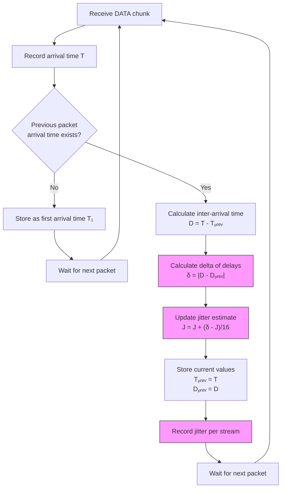

# Jitter in SCTP

Jitter represents the variation in packet delivery timing between consecutive data chunks. It is a critical metric for time-sensitive applications using SCTP, such as VoIP, video streaming, and real-time control systems.

## Importance in SCTP

Jitter is particularly important in SCTP because:

1. SCTP's multi-streaming capability can be leveraged to reduce jitter for critical streams
2. Multi-homed SCTP deployments may experience path-specific jitter patterns
3. Time-sensitive applications need predictable delivery timing
4. Jitter can reveal underlying network stability issues

## Jitter Calculation Mechanism



## Jitter Formula

SCTP jitter can be calculated using an adaptation of the RFC 3550 (RTP) jitter formula:

```
J = J + (|D(i) - D(i-1)| - J)/16
```

Where:
- J is the current jitter estimate
- D(i) is the inter-arrival time between packet i and i-1
- D(i-1) is the previous inter-arrival time

The divisor (16) provides smoothing, making the estimate less sensitive to outliers.

## SCTP-Specific Jitter Considerations

1. **Per-stream jitter**: Each stream can have different jitter characteristics
2. **Ordered vs. unordered delivery**: Unordered delivery typically has lower jitter
3. **Path-specific jitter**: Each path in multi-homed scenarios may exhibit different jitter
4. **Head-of-line blocking effect**: Ordered delivery can increase jitter due to blocking

## Measuring Jitter with `sctp_jitter.py`

The `sctp_jitter.py` tool uses eBPF to monitor packet timing in the kernel:

1. Traces the [sctp_eat_data](https://elixir.bootlin.com/linux/v6.16/source/net/sctp/sm_statefuns.c#L6486) function to track chunk transmission timing
2. Calculates inter-arrival times between consecutive packets
3. Computes jitter using the formula described above
4. Provides per-stream jitter statistics

Example usage:
```bash
sudo ./sctp_jitter.py
```

## Interpreting Jitter Results

Jitter thresholds for different application types:

| Application Type | Good Jitter | Acceptable Jitter | Poor Jitter |
|------------------|-------------|-------------------|-------------|
| VoIP | < 10 ms | 10-30 ms | > 30 ms |
| Video streaming | < 20 ms | 20-50 ms | > 50 ms |
| Online gaming | < 15 ms | 15-40 ms | > 40 ms |
| General data | < 30 ms | 30-100 ms | > 100 ms |

## Optimizing SCTP for Low Jitter

1. **Stream prioritization**: Place time-sensitive data on dedicated streams
2. **Unordered delivery**: Use unordered delivery for time-sensitive data when sequence doesn't matter
3. **QoS mechanisms**: Implement network-level QoS for SCTP traffic
4. **Path selection**: In multi-homed scenarios, select paths with consistent low jitter
5. **Buffer tuning**: Adjust buffer sizes to balance between throughput and jitter

## References

- [RFC 3550: RTP Jitter Calculation](https://tools.ietf.org/html/rfc3550#section-6.4.1)
- [RFC 4960: SCTP Protocol Specification](https://tools.ietf.org/html/rfc4960)