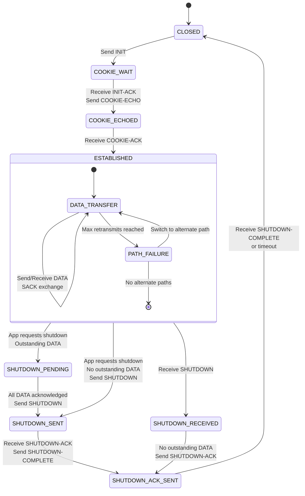
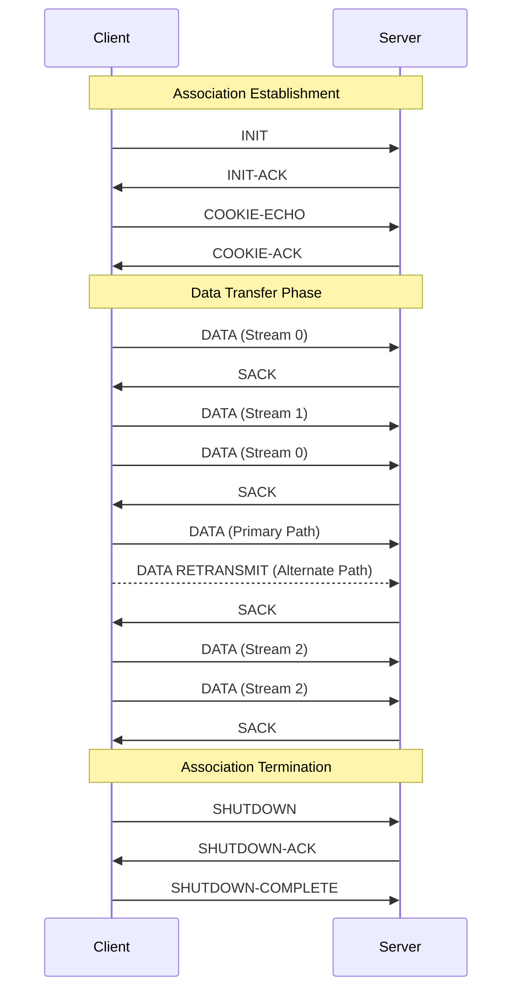

# SCTP Protocol Overview

Stream Control Transmission Protocol (SCTP) is a transport layer protocol designed to combine the reliability of TCP with message-oriented features and multi-homing capabilities.

## Key Features of SCTP

- **Multi-streaming**: Allows independent delivery of messages in parallel streams
- **Multi-homing**: Supports multiple IP addresses per endpoint for redundancy
- **Message-oriented**: Preserves message boundaries unlike TCP's byte-stream model
- **Four-way handshake**: Provides protection against SYN flooding attacks
- **Partial reliability**: Optional extension allowing for timed reliability
- **Selective acknowledgments**: Built-in by default (unlike TCP)

## SCTP Association State Diagram



## SCTP Connection Flow




## Key Performance Metrics

SCTP performance can be evaluated using several key metrics:

1. **Round Trip Time (RTT)**: Time for data to travel from sender to receiver and back
2. **Retransmission Timeout (RTO)**: Adaptive timer for retransmission decisions
3. **Buffer Utilization**: How efficiently send/receive buffers are being used
4. **Jitter**: Variation in packet delivery timing
5. **Stream Utilization**: How effectively multiple streams are being leveraged

Each of these metrics has dedicated tooling in the `sctptrace` project to provide detailed visibility into SCTP performance.

## References

- [RFC 4960: Stream Control Transmission Protocol](https://tools.ietf.org/html/rfc4960)
- [RFC 3758: SCTP Partial Reliability Extension](https://tools.ietf.org/html/rfc3758)
- [RFC 5061: SCTP Dynamic Address Reconfiguration](https://tools.ietf.org/html/rfc5061)


## File: `docs/stream_utilization.md`

```markdown

```

Each of these files provides comprehensive information about SCTP and the individual performance metrics, complete with state diagrams and explanations that will help users understand both the protocol and how to interpret the results from the `sctptrace` tools.

[^1] https://www.myreadingroom.co.in/notes-and-studymaterial/68-dcn/855-sctp-features.html