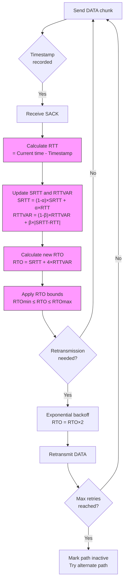

# Retransmission Timeout (RTO) in SCTP

Retransmission Timeout (RTO) is a critical timer mechanism that determines when to retransmit unacknowledged data chunks. SCTP uses an adaptive RTO algorithm that adjusts based on network conditions.

## Importance in SCTP

RTO is central to SCTP's reliability mechanism because:

1. It determines when unacknowledged data is considered lost
2. It adapts to changing network conditions
3. It influences congestion control behavior
4. In multi-homing scenarios, each path maintains a separate RTO

## RTO Calculation Mechanism



## Key Characteristics of SCTP RTO

1. **Initialization**: Initial RTO is typically set to 3 seconds (RTO.Initial)
2. **Bounds**: Minimum RTO is 1 second (RTO.Min), maximum is 60 seconds (RTO.Max)
3. **Per-path values**: Each destination address has its own RTO
4. **Exponential backoff**: RTO doubles with each consecutive retransmission
5. **Path failure**: After exceeding maximum retransmissions (Path.Max.Retrans), the path is marked inactive

## RTO Parameters in SCTP

| Parameter | Typical Value | Description |
|-----------|---------------|-------------|
| RTO.Initial | 3 seconds | Initial RTO value before RTT measurements |
| RTO.Min | 1 second | Lower bound on RTO |
| RTO.Max | 60 seconds | Upper bound on RTO |
| Alpha (α) | 1/8 | SRTT smoothing factor |
| Beta (β) | 1/4 | RTTVAR smoothing factor |
| Path.Max.Retrans | 5 | Maximum retransmissions before path is marked inactive |

## Measuring RTO with `sctp_rto.py`

The `sctp_rto.py` tool uses eBPF to monitor RTO-related events in the kernel:

1. Traces the [sctp_transport_update_rto()](https://elixir.bootlin.com/linux/v6.8/source/net/sctp/transport.c#L488) function to capture RTO updates
2. Traces the [sctp_generate_t3_rtx_event()](https://elixir.bootlin.com/linux/v6.8/source/net/sctp/sm_sideeffect.c#L231) function to capture retransmission events
3. Tracks SRTT and RTTVAR values used in RTO calculation
4. Monitors RTO exponential backoff during retransmissions

Example usage:
```bash
sudo ./sctp_rto.py
```

## Interpreting RTO Results

- **Low, stable RTO**: Indicates good network conditions
- **RTO near RTO.Min (1s)**: Network is stable with consistent RTT
- **High RTO values**: May indicate variable network conditions or packet loss
- **Exponential backoff observed**: Shows packet loss requiring multiple retransmissions
- **Path switching after RTO events**: Indicates path failure in multi-homed scenarios

## Optimizing SCTP RTO Behavior

1. **Adjust RTO parameters**: Tune RTO.Min, RTO.Max for specific network conditions
2. **Modify Path.Max.Retrans**: Adjust how quickly SCTP fails over to alternate paths
3. **Network improvements**: Reduce packet loss to prevent RTO exponential backoff
4. **Buffer tuning**: Appropriate buffer sizes can reduce congestion-related losses

## References

- [RFC 4960 Section 6.3.1: RTO Calculation](https://tools.ietf.org/html/rfc4960#section-6.3.1)
- [RFC 4960 Section 6.3.3: Handle T3-rtx Expiration](https://tools.ietf.org/html/rfc4960#section-6.3.3)