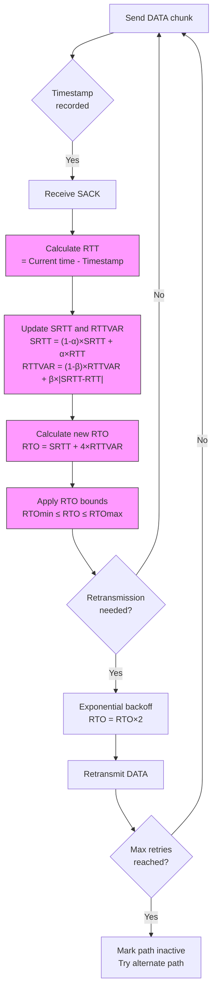

# Round Trip Time (RTT) in SCTP

Round Trip Time (RTT) is a fundamental metric in network protocols that measures the time taken for a data packet to travel from sender to receiver and for an acknowledgment to return to the sender.

## Importance in SCTP

In SCTP, RTT measurements are particularly important because:

1. SCTP uses RTT to calculate Retransmission Timeout (RTO) values
2. Unlike TCP, SCTP calculates RTT separately for each destination address in multi-homed scenarios
3. RTT affects throughput, especially in long-distance or high-latency networks
4. Sudden changes in RTT can indicate network congestion or path switching

## RTT Measurement Process in SCTP



## Key Characteristics of SCTP RTT

1. **Per-path measurement**: SCTP calculates RTT separately for each destination address
2. **TSN-based tracking**: RTT is measured using Transmission Sequence Numbers
3. **Heartbeat-based measurement**: For idle paths, SCTP uses HEARTBEAT chunks to measure RTT
4. **Smoothed calculations**: Uses exponential weighted moving average similar to TCP

## Normal RTT Values

RTT values vary widely depending on network conditions:

- **Local network**: 0.1-2 ms
- **Same city/region**: 5-20 ms
- **Cross-country**: 30-100 ms
- **Intercontinental**: 100-400 ms
- **Satellite connections**: 500-1000+ ms

## Measuring RTT with `sctp_rtt.py`

The `sctp_rtt.py` tool uses eBPF to hook into the kernel's SCTP implementation and track RTT measurements in real-time:

1. Traces the [sctp_transmit_packet()](https://elixir.bootlin.com/linux/v6.8/source/net/sctp/output.c#L569) function to capture packet send times
2. Traces the [sctp_sf_eat_sack()](https://elixir.bootlin.com/linux/v6.8/source/net/sctp/sm_statefuns.c#L3392) function to capture acknowledgment times
3. Calculates the difference to determine RTT
4. Provides statistics including average, minimum, and maximum RTT values

Example usage:
```bash
sudo ./sctp_rtt.py
```

## Interpreting RTT Results

- **Stable, low RTT**: Indicates good network conditions
- **High RTT**: May indicate network congestion or long-distance connections
- **Variable RTT**: Shows network instability or competing traffic
- **Sudden RTT changes**: Could indicate path failover in multi-homed configurations

## Optimizing SCTP RTT

1. **Network infrastructure improvements**: Reduce physical latency
2. **Buffer tuning**: Appropriate buffer sizes can minimize unnecessary delays
3. **Path selection**: In multi-homed scenarios, prefer paths with lower RTT
4. **Traffic prioritization**: QoS mechanisms can reduce RTT for SCTP traffic

## References

- ["RFC 4960 Section 6.3.1: RTO Calculation"](https://tools.ietf.org/html/rfc4960#section-6.3.1)
- ["RFC 4960 Section 8.3: Path Heartbeat"](https://tools.ietf.org/html/rfc4960#section-8.3)