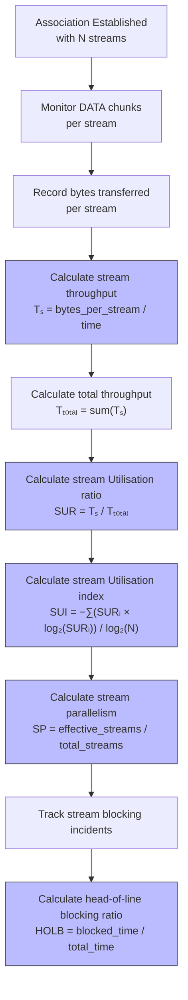

# Stream Utilisation in SCTP

Stream utilisation measures how effectively an application leverages SCTP's multi-streaming capability. This is one of SCTP's key advantages over TCP, allowing independent message delivery across multiple logical streams within a single association.

## Importance in SCTP

Stream utilisation metrics are important because:

1. They reveal if applications are fully benefiting from SCTP's multi-streaming advantage
2. Poor stream distribution can negate SCTP's head-of-line blocking prevention
3. Proper stream utilisation directly impacts application performance
4. Stream usage patterns can guide application-level optimisations

## Stream Utilisation Metrics



## Key Stream Utilisation Metrics

1. **Stream Utilisation Ratio (SUR)**: Proportion of traffic carried by each stream
2. **Stream Utilisation Index (SUI)**: Entropy-based measure of traffic distribution
   - SUI = 1.0 indicates perfectly balanced stream usage
   - SUI = 0.0 indicates only one stream being used
3. **Stream Parallelism (SP)**: Ratio of effectively used streams to total available streams
4. **Ordered/Unordered Ratio**: Proportion of ordered vs. unordered deliveries
5. **Head-of-Line Blocking Ratio**: Measures impact of ordered delivery on throughput

## SCTP Stream Characteristics

- **Independent sequence numbering**: Each stream has its own sequence space
- **Stream identifier**: 16-bit value allowing up to 65,535 streams
- **Ordered/unordered delivery**: Can be set per message, not per stream
- **No built-in prioritisation**: All streams have equal priority by default
- **Stream reset capability**: Allows dynamic stream reconfiguration (extension)

## Measuring Stream Utilisation with `sctp_streamutil.py`

The `sctp_streamutil.py` tool uses eBPF to monitor stream usage patterns:

1. Traces the `sctp_make_data_chunk()` function to track chunk creation
2. Traces the `sctp_chunk_output()` function to monitor actual transmission
3. Tracks per-stream data volumes and chunk counts
4. Calculates stream Utilisation metrics including SUI and stream parallelism

Example usage:
```bash
sudo ./sctp_streamutil.py
```

## Interpreting Stream Utilisation Results

- **High SUI (> 0.8)**: Indicates well-balanced stream usage
- **Low SUI (< 0.5)**: Shows poor stream distribution, negating multi-streaming benefits
- **High unordered ratio**: Shows effective use of unordered delivery to avoid head-of-line blocking
- **Low stream parallelism**: Indicates inefficient use of available streams
- **Varied stream sizes**: May indicate natural application message patterns or poor stream allocation

## Optimizing SCTP Stream Usage

1. **Logical message grouping**: Assign related messages to the same stream
2. **Independent data separation**: Place independent data flows on separate streams
3. **Unordered delivery**: Use when message sequence isn't important
4. **Stream count tuning**: Balance between too few (limits parallelism) and too many (increases overhead)
5. **Application-level stream management**: Implement stream allocation strategies based on message characteristics

## References

- [RFC 4960 Section 1.4: Multi-streaming](https://tools.ietf.org/html/rfc4960#section-1.4)
- [RFC 6525: SCTP Stream Reconfiguration](https://tools.ietf.org/html/rfc6525)